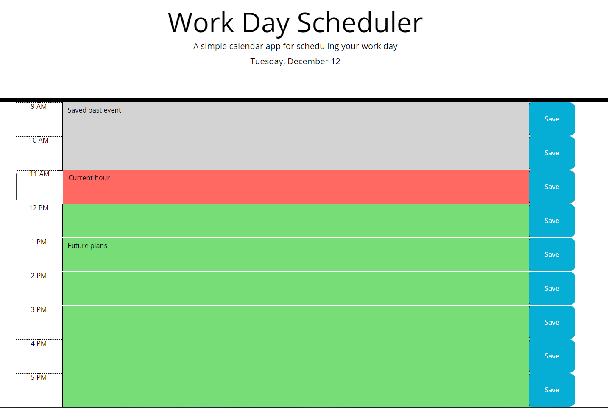

# Day_Planner_AP

This application is a simple day planner that you can use to plan your workday.

​[Deployed Application](https://lxpap.github.io/Day_Planner_AP)

## Installation

No installation is necessary for this application.

## Usage

This application has one block for each hour for the standard working hours. It is colour-coded to indicate past time (grey), current time (red), and future time (green). Once you type in your plans for each hour in the respective box, you can click save on this slot and have the ability to view them again once you refresh or reload the page after closing it.

   

   

## Credits

Information and research to aid development was done using the following resources:

[StackOverflow](https://stackoverflow.com/)

[MDN](https://developer.mozilla.org/en-US/)

[ClaudeAI](https://claude.ai/)

## License

A copy of the MIT License can be found in this repository.
